---
# try also 'default' to start simple
theme: seriph
# random image from a curated Unsplash collection by Anthony
# like them? see https://unsplash.com/collections/94734566/slidev
background: https://source.unsplash.com/collection/94734566/1920x1080
# apply any windi css classes to the current slide
class: 'text-center'
# https://sli.dev/custom/highlighters.html
highlighter: shiki
# show line numbers in code blocks
lineNumbers: false
# some information about the slides, markdown enabled
info: |
  ## Slidev Starter Template
  Presentation slides for developers.

  Learn more at [Sli.dev](https://sli.dev)
# persist drawings in exports and build
drawings:
  persist: false
# page transition
transition: slide-left
# use UnoCSS
css: unocss
---

# A Comprehensive Study on SolOSphere: An Advanced Tool Suite for Solidity Contract Optimization

SolOSphere the ultimate solution for solidty contracts

<!--
The last comment block of each slide will be treated as slide notes. It will be visible and editable in Presenter Mode along with the slide. [Read more in the docs](https://sli.dev/guide/syntax.html#notes)
-->

---
transition: fade-out
---


# Introduction
The advent of Solidity Smart Contracts

- Solidity as the primary language for Ethereum Smart Contracts.
- The rise of smart contracts and their potential to revolutionize contractual agreements.


---
transition: slide-up
---

# Introduction (cont.)
Problem Statement

- The inefficiencies and complexities of current smart contracts due to inefficient gas usage.
- The gap between the potential of smart contracts and their real-world performance.


---
transition: slide-up
---

# Introduction (cont.)
The Solution

- Introduction to SolOSphere, the comprehensive suite designed for contract optimization.
- Overview of SolOSphere components: SolO, SolOLab, SMARTS, and SMARTS-GPT.
- How SolOSphere addresses the issue of inefficient gas usage in smart contracts.


---
transition: slide-up
---

# Background
Solidity Smart Contracts

- **Solidity**: A statically-typed, contract-oriented programming language widely used for developing Ethereum Smart Contracts.
- **Smart Contracts**: Autonomous, self-executing contracts with the terms of the agreement directly written into code. They exist across a distributed, decentralized blockchain network.
- **Role of Solidity in Smart Contracts**: Solidity provides the necessary constructs to build complex contracts on the Ethereum network, fostering a wide range of decentralized applications (DApps).

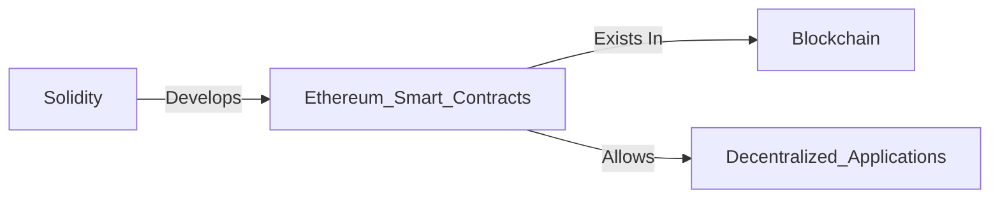

---
transition: slide-up
---

# Background (cont.)
Gas in Ethereum Network

- **Gas**: An internal pricing unit for running transactions or smart contracts on Ethereum.
- **Purpose of Gas**: Used to allocate resources of the Ethereum virtual machine (EVM), ensuring that contracts run efficiently and securely.
- **Gas and Contract Execution**: Each operation in the execution of a contract consumes a certain amount of gas, with more complex computations requiring more gas.


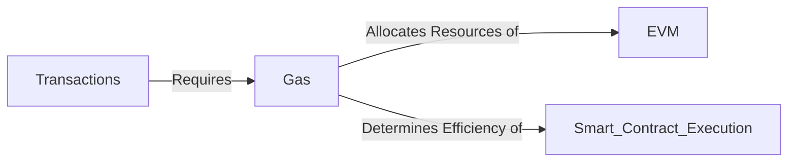

---
transition: slide-up
---

# Background (cont.)
Miners and the Ethereum Network

- **Miners**: Individuals or entities that validate new transactions and record them on the global ledger (blockchain).
- **Role of Miners**: Miners play a crucial role in maintaining the integrity of the Ethereum network. They validate and execute smart contract computations.
- **Gas and Miners**: Miners are compensated for their computational work in 'gas fees', which are paid by the users initiating the smart contract.

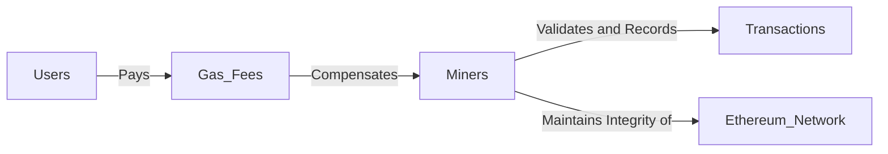
---
transition: slide-up
---

# Background (cont.)
Parsing and Deploying Smart Contracts

- **Parsing**: The process of analyzing a string of symbols in a programming language. In the context of Solidity contracts, parsing refers to reading and interpreting the contract's code.
- **Deploying**: The process of taking a contract written in Solidity and placing it onto the Ethereum blockchain, where it is executed within the EVM.

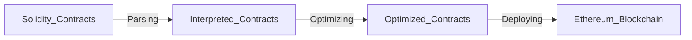


---
transition: slide-up
---

# Related Work
Existing Optimizers

- GasSaver
- GASOL
- GasChecker


---
transition: slide-up
---

# Methodology
Overview

- Process begins with the utilization of SMARTS to scrape GitHub for contract source codes.
- These source codes are parsed and unparsed using SolO to verify its functionality.
- Generation of new contracts using SMARTS-GPT and text-DaVinci-003 model.
- Deployment of generated contracts and comparison of gas usage between optimized and unoptimized versions using SolOLab.
- Creation and mutation of custom contracts for further testing and verification of SolO.

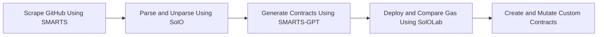

---
transition: slide-up
---

# Methodology (cont.)
SMARTS and GitHub

- SMARTS retrieves smart contract source codes from GitHub.
- 612 files were tested to verify the functionality of SolO's parser and unparser.
- Challenges faced: Out of 612 files, 417 did not function due to unparser errors.


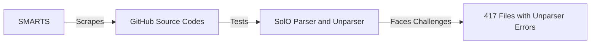

---
transition: slide-up
---

# Methodology (cont.)
SMARTS-GPT and Contract Generation

- SMARTS-GPT, with the text-DaVinci-003 model, was used to generate 192 new contracts.
- Minor fixes were required in some contracts due to inaccuracies in the GPT model.
- These contracts were used to verify the deployment and comparison of gas consumption in SolOLab.

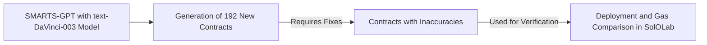

---
transition: slide-up
---

# Methodology (cont.)
SolOLab and Contract Deployment

- Contracts were divided into two folders - optimized and unoptimized.
- Python Brownie was used to deploy the contracts and compare the gas usage.
- Results: Slight optimization in gas, but all contracts were successfully deployed.


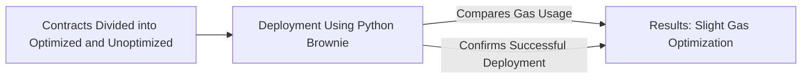

---
transition: slide-up
---
# Methodology (cont.)
Custom Contracts

- Five custom contracts were created for testing.
- Using GPT, these contracts were mutated into 50 unique versions.
- The mutated contracts were deployed and their gas was compared, demonstrating successful optimization, particularly for loops.


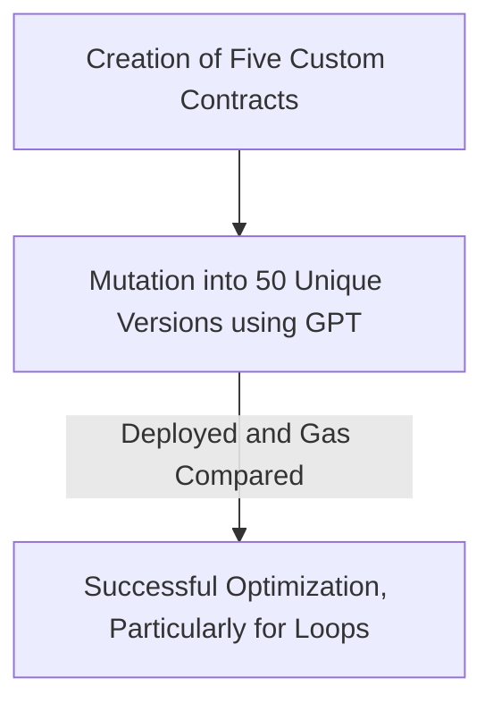

---
transition: slide-up
---

# SoloSphere Components

List of all the components


- 🥼**SolOLab** - This component focuses on the experiments
- 📱 **SMARTS** - This component focuses on scraping smart contracts
- ☢️ **SolO** - The main core optimizer

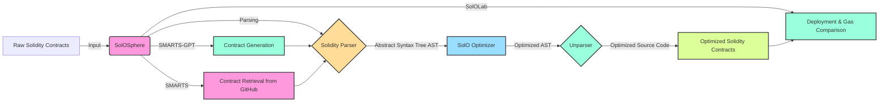

<!--
You can have `style` tag in markdown to override the style for the current page.
Learn more: https://sli.dev/guide/syntax#embedded-styles
-->

<style>
h1 {
  background-color: #2B90B6;
  background-image: linear-gradient(45deg, #4EC5D4 10%, #146b8c 20%);
  background-size: 100%;
  -webkit-background-clip: text;
  -moz-background-clip: text;
  -webkit-text-fill-color: transparent;
  -moz-text-fill-color: transparent;
}
</style>

<!--
Here is another comment.
-->

---
transition: slide-up
layout: two-cols
---

# SolO
Parser


```solidity
contract SimpleContract {
  uint x;
  uint total = 100;
  
  function setX(uint _x) public {
    x = _x;
  }
}
```


::right::

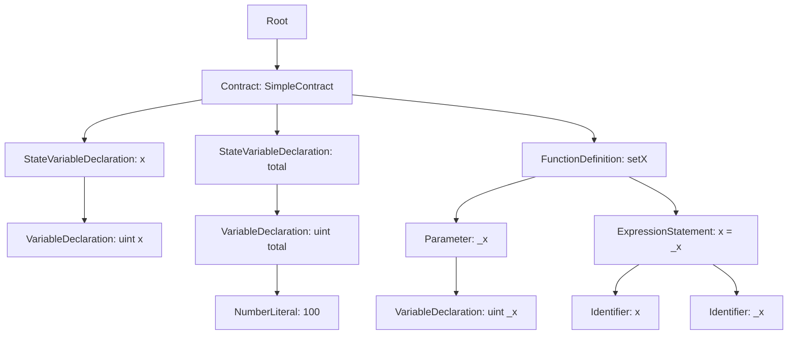


---
transition: slide-up
layout: two-cols
---

# SolO Patterns
**SolO** - The main core optimizer

- Packing
  - Struct Packing ✅ 
  - Variable Packing ✅ 
  - Boolean Packing ⛔️
- Types
  - Uint* vs Uint256 ⛔️
  - Bytes vs Strings ⛔️
  - Fixed Size ✅
  - Default Value ✅ 
- Data Location
  - Call Data vs Memory ✅ 
  - Freeing Storage ⛔️

::right::

- Function Visibility
  - Internal vs External  ✅
  - Constant and Immutable  ✅
- Operation Reduction
  - Reducing Expression  ✅
  - Short Circuiting ⛔️
  - Write Values   ✅
  - Single Line Swap ✅
- Function Reduction
  - Limit Number of Functions ⛔️
  - Limit Modifiers ⛔️
- Loop Combination
  - Prohibit The Use of Nested Loops ⛔️
  - Simplify Multiple Loops ⛔️
  - Repetitive Arithmetic Operations in Loop ✅

---
transition: slide-up
layout: two-cols
---

# SolO Patterns (cont.)
**SolO** - The main core optimizer

- Caching
  - Cache Storage Variable  ✅
  - Caching Member Variable  ✅
  - Cache Array Length ✅
  - Loop Increment ✅ 
- Mapping 
  - Mapping vs Array ⛔️


---
transition: slide-up
---

# SolO Patterns (cont.)
High level Optimizations Overview

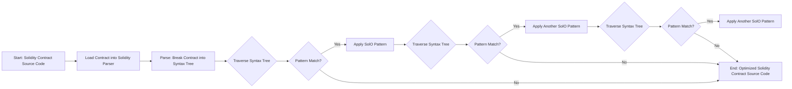

```mermaid
graph LR;
    A[Raw Solidity Contract]
    B[Parser]
    C[Abstract Syntax Tree AST]
    D[Optimizer]
    E[Optimized AST]
    F[Unparser]
    G[Optimized Solidity Contract]
    A-->B;
    B-->C;
    C-->D;
    D-->E;
    E-->F;
    F-->G;
    class A phase1
    class B phase2
    class C phase3
    class D phase4
    class E phase5
    class F phase6
    class G phase7
    classDef phase1 fill:#f9d,stroke:#333,stroke-width:2px;
    classDef phase2 fill:#fd9,stroke:#333,stroke-width:2px;
    classDef phase3 fill:#9df,stroke:#333,stroke-width:2px;
    classDef phase4 fill:#9fd,stroke:#333,stroke-width:2px;
    classDef phase5 fill:#df9,stroke:#333,stroke-width:2px;
    classDef phase6 fill:#f9d,stroke:#333,stroke-width:2px;
    classDef phase7 fill:#9fd,stroke:#333,stroke-width:2px;

```

---
transition: slide-up
---

# Evaluation
Format

<Transform scale=0.5>

| Contract1 Name | Contract1 Gas | Contract2 Name | Contract2 Gas | Counter Contract1 | Counter Contract2 | Loop24 Contract1 | Loop24 Contract2 | X Contract1 | X Contract2 |
|----------------|---------------|----------------|---------------|-------------------|-------------------|------------------|------------------|-------------|-------------|
| mutated41      | 298144        | Opt_mutated41  | 274852        | 23414             | 23414             | 40149            | 32941            | 23370       | 23370       |
| mutated9       | 298144        | Opt_mutated9   | 274852        | 23414             | 23414             | 40149            | 32941            | 23370       | 23370       |
| mutated8       | 295138        | Opt_mutated8   | 272044        | 23414             | 23414             | 43965            | 36757            | 23370       | 23370       |
| mutated40      | 298144        | Opt_mutated40  | 274852        | 23414             | 23414             | 40149            | 32941            | 23370       | 23370       |
| mutated42      | 298144        | Opt_mutated42  | 274852        | 23414             | 23414             | 40149            | 32941            | 23370       | 23370       |
| simple4        | 267262        | Opt_simple4    | 244167        | 23414             | 23414             | 40149            | 32941            | 23370       | 23370       |
| mutated43      | 298144        | Opt_mutated43  | 274852        | 23414             | 23414             | 40149            | 32941            | 23370       | 23370       |
| mutated47      | 298144        | Opt_mutated47  | 274852        | 23414             | 23414             | 40149            | 32941            | 23370       | 23370       |
| simple1        | 105879        | Opt_simple1    | 105879        | 23370             | 23370             | -                | -                | -           | -           |
| mutated46      | 280870        | Opt_mutated46  | 257776        | 23414             | 23414             | 40149            | 32941            | 23370       | 23370       |
| mutated44      | 298144        | Opt_mutated44  | 274852        | 23414             | 23414             | 40149            | 32941            | 23370       | 23370       |
| simple3        | 248487        | Opt_simple3    | 225633        | 23392             | 23392             | 40127            | 32916            | 23370       | 23370       |
| simple2        | 148547        | Opt_simple2    | 147479        | 23370             | 23370             | 40105            | 32897            | -           | -           |
| mutated45      | 298144        | Opt_mutated45  | 274852        | 23414             | 23414             | 40149            | 32941            | 23370       | 23370       |
| -              | -             | -              | -             | -                 | -                 | -                | -                | -           | -           |
| mutated23      | 266818        | Opt_mutated23  | 243735        | 23414             | 23414             | 40005            | 32797            | 23370       | 23370       |
| mutated37      | 298144        | Opt_mutated37  | 274852        | 23414             | 23414             | 40149            | 32941            | 23370       | 23370       |
| mutated21      | 298132        | Opt_mutated21  | 274852        | 23414             | 23414             | 40149            | 32941            | 23370       | 23370       |
 
</Transform>


---
transition: slide-up
---

# Evaluation (cont.)
Chart 1 Deployment


---

# Evaluation (cont.)
Chart 2 Execution of loop24


---

# Future Work
SoloSphere's future

## Enhancing Pattern Recognition
- Expanding the unparser to recognize a broader range of patterns.
- Implementing an AI system that identifies patterns autonomously.

## Optimization Improvements
- Further development of gas optimization algorithms.
- Implementation of an AI-driven system that optimizes gas usage automatically.

## Broadening Capabilities
- Increase the diversity and versatility of recognized patterns for more comprehensive coverage.
- Automated adjustment and improvement in response to evolving Ethereum protocols.


---

# Conclusion
SoloSphere's conclusion

## Project Achievements
- Successfully developed Solosphere for Ethereum gas optimization.
- Recognized and utilized various patterns for gas reduction.