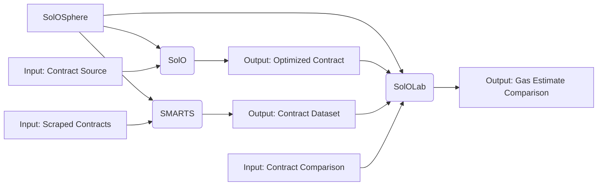
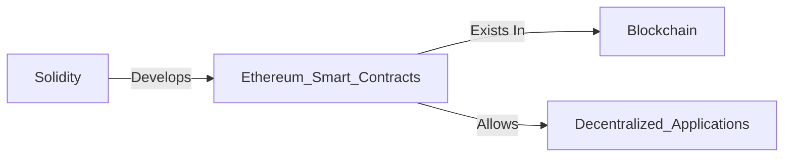
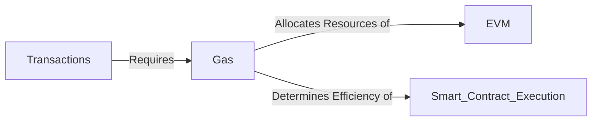
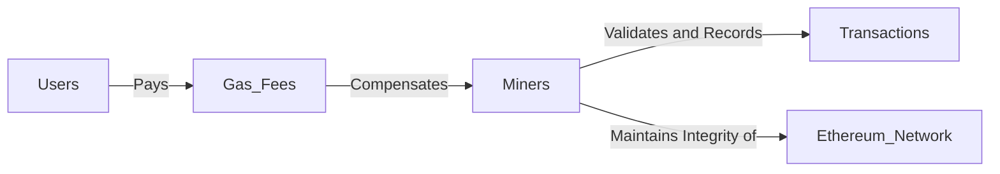
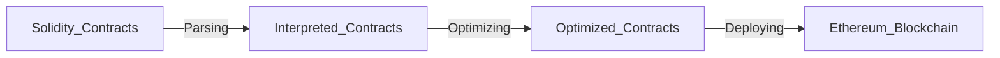
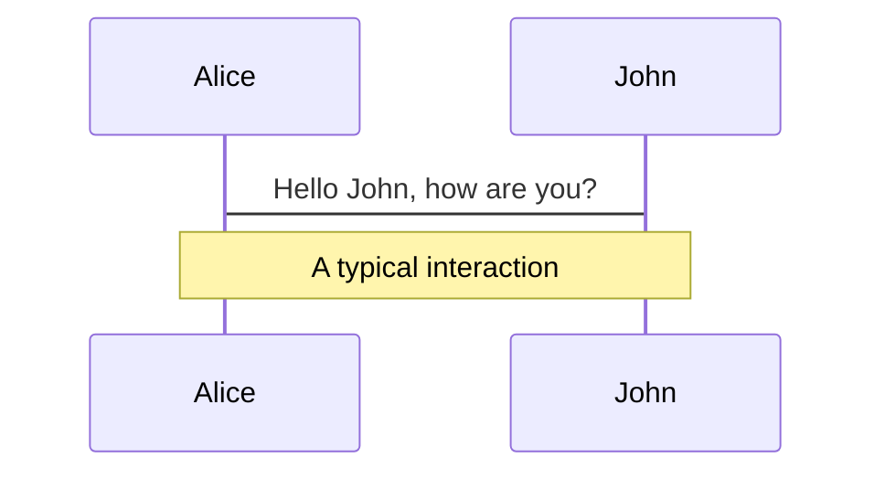
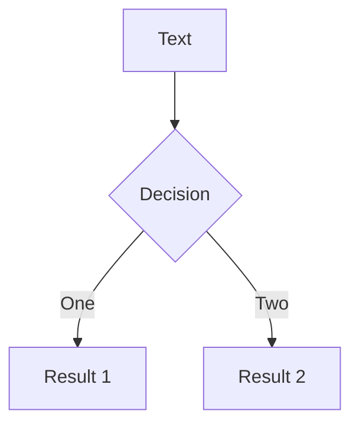
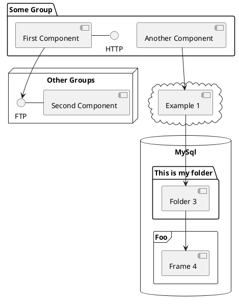

---
# try also 'default' to start simple
theme: seriph
# random image from a curated Unsplash collection by Anthony
# like them? see https://unsplash.com/collections/94734566/slidev
background: https://source.unsplash.com/collection/94734566/1920x1080
# apply any windi css classes to the current slide
class: 'text-center'
# https://sli.dev/custom/highlighters.html
highlighter: shiki
# show line numbers in code blocks
lineNumbers: false
# some information about the slides, markdown enabled
info: |
  ## Slidev Starter Template
  Presentation slides for developers.

  Learn more at [Sli.dev](https://sli.dev)
# persist drawings in exports and build
drawings:
  persist: false
# page transition
transition: slide-left
# use UnoCSS
css: unocss
---

# A Comprehensive Study on SolOSphere: An Advanced Tool Suite for Solidity Contract Optimization

SolOSphere the ultimate solution for solidty contracts

<!--
The last comment block of each slide will be treated as slide notes. It will be visible and editable in Presenter Mode along with the slide. [Read more in the docs](https://sli.dev/guide/syntax.html#notes)
-->

---
transition: fade-out
---

# SoloSphere Components

List of all the components


- 🥼**SolOLab** - This component focuses on the experiments
- 📱 **SMARTS** - This component focuses on scraping smart contracts
- ☢️ **SolO** - The main core optimizer



<!--
You can have `style` tag in markdown to override the style for the current page.
Learn more: https://sli.dev/guide/syntax#embedded-styles
-->

<style>
h1 {
  background-color: #2B90B6;
  background-image: linear-gradient(45deg, #4EC5D4 10%, #146b8c 20%);
  background-size: 100%;
  -webkit-background-clip: text;
  -moz-background-clip: text;
  -webkit-text-fill-color: transparent;
  -moz-text-fill-color: transparent;
}
</style>

<!--
Here is another comment.
-->

---
transition: slide-up
---

# Introduction
The advent of Solidity Smart Contracts

- Solidity as the primary language for Ethereum Smart Contracts.
- The rise of smart contracts and their potential to revolutionize contractual agreements.


---
transition: slide-up
---

# Introduction (cont.)
Problem Statement

- The inefficiencies and complexities of current smart contracts due to inefficient gas usage.
- The gap between the potential of smart contracts and their real-world performance.


---
transition: slide-up
---

# Introduction (cont.)
The Solution

- Introduction to SolOSphere, the comprehensive suite designed for contract optimization.
- Overview of SolOSphere components: SolO, SolOLab, SMARTS, and SMARTS-GPT.
- How SolOSphere addresses the issue of inefficient gas usage in smart contracts.


---
transition: slide-up
---

# Background
Solidity Smart Contracts

- **Solidity**: A statically-typed, contract-oriented programming language widely used for developing Ethereum Smart Contracts.
- **Smart Contracts**: Autonomous, self-executing contracts with the terms of the agreement directly written into code. They exist across a distributed, decentralized blockchain network.
- **Role of Solidity in Smart Contracts**: Solidity provides the necessary constructs to build complex contracts on the Ethereum network, fostering a wide range of decentralized applications (DApps).



---
transition: slide-up
---

# Background (cont.)
Gas in Ethereum Network

- **Gas**: An internal pricing unit for running transactions or smart contracts on Ethereum.
- **Purpose of Gas**: Used to allocate resources of the Ethereum virtual machine (EVM), ensuring that contracts run efficiently and securely.
- **Gas and Contract Execution**: Each operation in the execution of a contract consumes a certain amount of gas, with more complex computations requiring more gas.




---
transition: slide-up
---

# Background (cont.)
Miners and the Ethereum Network

- **Miners**: Individuals or entities that validate new transactions and record them on the global ledger (blockchain).
- **Role of Miners**: Miners play a crucial role in maintaining the integrity of the Ethereum network. They validate and execute smart contract computations.
- **Gas and Miners**: Miners are compensated for their computational work in 'gas fees', which are paid by the users initiating the smart contract.


---
transition: slide-up
---

# Background (cont.)
Parsing and Deploying Smart Contracts

- **Parsing**: The process of analyzing a string of symbols in a programming language. In the context of Solidity contracts, parsing refers to reading and interpreting the contract's code.
- **Deploying**: The process of taking a contract written in Solidity and placing it onto the Ethereum blockchain, where it is executed within the EVM.




---
transition: slide-up
layout: two-cols
---

# SolO Patterns
**SolO** - The main core optimizer

- Packing
  - Struct Packing ✅ ✅
  - Variable Packing ✅ ✅
  - Boolean Packing ⛔️
- Types
  - Uint* vs Uint256 ⛔️
  - Bytes vs Strings ⛔️
  - Fixed Size 2️⃣ ✅
  - Default Value ✅ ✅
- Data Location
  - Call Data vs Memory ✅ ✅
  - Freeing Storage ⛔️

::right::

- Function Visibility
  - Internal vs External 2️⃣ ✅
  - Constant and Immutable 2️⃣ ✅
- Operation Reduction
  - Reducing Expression 2️⃣ ✅
  - Short Circuiting ⛔️
  - Write Values  2️⃣ ✅
  - Single Line Swap 2️⃣ 🤕
- Function Reduction
  - Limit Number of Functions ⛔️
  - Limit Modifiers ⛔️
- Loop Combination
  - Prohibit The Use of Nested Loops ⛔️
  - Simplify Multiple Loops ⛔️
  - Repetitive Arithmetic Operations in Loop ✅ ✅

---
transition: slide-up
layout: two-cols
---

# SolO Patterns (cont.)
**SolO** - The main core optimizer

- Caching
  - Cache Storage Variable ✅ ✅
  - Caching Member Variable 2️⃣ ✅
  - Cache Array Length 2️⃣ ✅
  - Loop Increment ✅ ✅
- Mapping 
  - Mapping vs Array ⛔️

---
layout: image-right
image: https://source.unsplash.com/collection/94734566/1920x1080
---

# Code

Use code snippets and get the highlighting directly![^1]

```ts {all|2|1-6|9|all}
interface User {
  id: number
  firstName: string
  lastName: string
  role: string
}

function updateUser(id: number, update: User) {
  const user = getUser(id)
  const newUser = { ...user, ...update }
  saveUser(id, newUser)
}
```

<arrow v-click="3" x1="400" y1="420" x2="230" y2="330" color="#564" width="3" arrowSize="1" />

[^1]: [Learn More](https://sli.dev/guide/syntax.html#line-highlighting)

<style>
.footnotes-sep {
  @apply mt-20 opacity-10;
}
.footnotes {
  @apply text-sm opacity-75;
}
.footnote-backref {
  display: none;
}
</style>

---

# Components

<div grid="~ cols-2 gap-4">
<div>

You can use Vue components directly inside your slides.

We have provided a few built-in components like `<Tweet/>` and `<Youtube/>` that you can use directly. And adding your custom components is also super easy.

```html
<Counter :count="10" />
```

<!-- ./components/Counter.vue -->
<Counter :count="10" m="t-4" />

Check out [the guides](https://sli.dev/builtin/components.html) for more.

</div>
<div>

```html
<Tweet id="1390115482657726468" />
```

<Tweet id="1390115482657726468" scale="0.65" />

</div>
</div>

<!--
Presenter note with **bold**, *italic*, and ~~striked~~ text.

Also, HTML elements are valid:
<div class="flex w-full">
  <span style="flex-grow: 1;">Left content</span>
  <span>Right content</span>
</div>
-->


---
class: px-20
---

# Themes

Slidev comes with powerful theming support. Themes can provide styles, layouts, components, or even configurations for tools. Switching between themes by just **one edit** in your frontmatter:

<div grid="~ cols-2 gap-2" m="-t-2">

```yaml
---
theme: default
---
```

```yaml
---
theme: seriph
---
```


</div>

Read more about [How to use a theme](https://sli.dev/themes/use.html) and
check out the [Awesome Themes Gallery](https://sli.dev/themes/gallery.html).

---
preload: false
---

# Animations

Animations are powered by [@vueuse/motion](https://motion.vueuse.org/).

```html
<div
  v-motion
  :initial="{ x: -80 }"
  :enter="{ x: 0 }">
  Slidev
</div>
```

<div class="w-60 relative mt-6">
  <div class="relative w-40 h-40">
    
    
    
  </div>

  <div
    class="text-5xl absolute top-14 left-40 text-[#2B90B6] -z-1"
    v-motion
    :initial="{ x: -80, opacity: 0}"
    :enter="{ x: 0, opacity: 1, transition: { delay: 2000, duration: 1000 } }">
    Slidev
  </div>
</div>

<!-- vue script setup scripts can be directly used in markdown, and will only affects current page -->
<script setup lang="ts">
const final = {
  x: 0,
  y: 0,
  rotate: 0,
  scale: 1,
  transition: {
    type: 'spring',
    damping: 10,
    stiffness: 20,
    mass: 2
  }
}
</script>

<div
  v-motion
  :initial="{ x:35, y: 40, opacity: 0}"
  :enter="{ y: 0, opacity: 1, transition: { delay: 3500 } }">

[Learn More](https://sli.dev/guide/animations.html#motion)

</div>

---

# LaTeX

LaTeX is supported out-of-box powered by [KaTeX](https://katex.org/).

<br>

Inline $\sqrt{3x-1}+(1+x)^2$

Block
$$
\begin{array}{c}

\nabla \times \vec{\mathbf{B}} -\, \frac1c\, \frac{\partial\vec{\mathbf{E}}}{\partial t} &
= \frac{4\pi}{c}\vec{\mathbf{j}}    \nabla \cdot \vec{\mathbf{E}} & = 4 \pi \rho \\

\nabla \times \vec{\mathbf{E}}\, +\, \frac1c\, \frac{\partial\vec{\mathbf{B}}}{\partial t} & = \vec{\mathbf{0}} \\

\nabla \cdot \vec{\mathbf{B}} & = 0

\end{array}
$$

<br>

[Learn more](https://sli.dev/guide/syntax#latex)

---

# Diagrams

You can create diagrams / graphs from textual descriptions, directly in your Markdown.

<div class="grid grid-cols-3 gap-10 pt-4 -mb-6">







</div>

[Learn More](https://sli.dev/guide/syntax.html#diagrams)

---
src: ./pages/multiple-entries.md
hide: false
---

---
layout: center
class: text-center
---

# Learn More

[Documentations](https://sli.dev) · [GitHub](https://github.com/slidevjs/slidev) · [Showcases](https://sli.dev/showcases.html)
